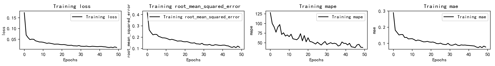
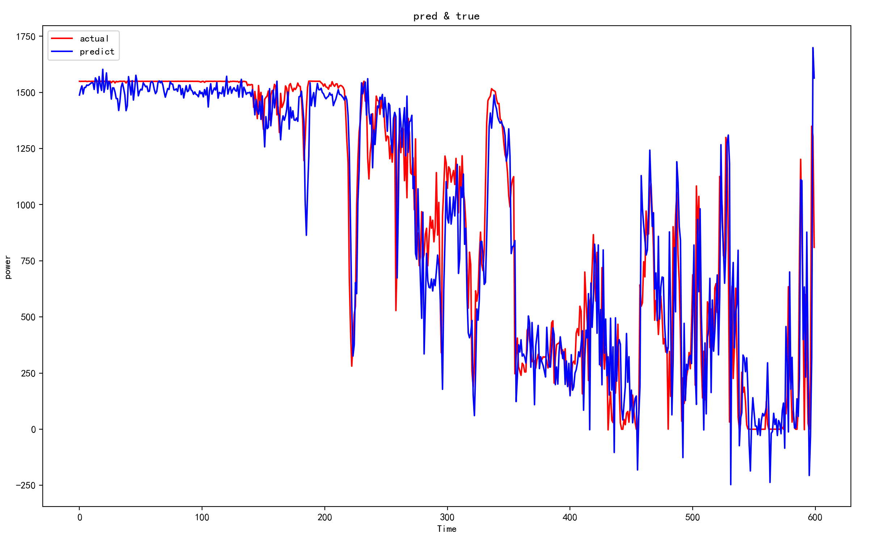

# FD_gisway

## Environment
在 _Python Console_ 运行如下代码：
```python
import matplotlib 
print(matplotlib.matplotlib_fname())
```
输出：xxx/lib/python3.9/site-packages/matplotlib/mpl-data/matplotlibrc

下载 http://129.204.205.246/downloads/SimHei.ttf 文件并复制到 xxx/lib/python3.7/site-packages/matplotlib/mpl-data/fonts/ttf 中。

在 _Python Console_ 运行如下代码：
```python
import matplotlib
print(matplotlib.get_cachedir())
```
最后在命令行输入：
```bash
>> rm -rf 输出的地址/*
```


## Requirements
```bash
>> pip install -r requirements.txt
```

## Dataset
训练数据格式依据 [wtbdata_245days](https://aistudio.baidu.com/competition/detail/152/0/introduction) ，可在链接 [link](https://aistudio.baidu.com/competition/detail/152/0/introduction) 中下载。请将数据集和其他文件置于同一目录中。
```
FD_gisway
 |-- eval.py
 |-- train.py
 |--    .
 |--    .
 |--    .
 |-- wtbdata_245days.csv
```
每10分钟采集一次数据，共9个变量。

测试数据格式依据 test.csv。

## Model and Evaluation
评价指标包含 ***mae, rmse, mape, r^2*** 四种。
```python
# eval.py
def evaluation(y_test, y_predict):
    ...
    return mae, rmse, mape, r_2
```
可选模型包含 **LSTM,RNN,GRU,CNN,MLP** 五种，均具有两层隐藏层。

## Training and Parameter
根据实际需要更改如下一些参数。

文件输入的路径：
```python
#train.py 17:
data0 = pd.read_csv('wtbdata_245days.csv')
```
文件采用多少数据训练。对于 _window_size_ = 18， _step_ = 1，隐藏层结点数为 108、36 时，约3000行数据即可。
```python
#train.py 20:
data0 = data0[:3000]
```
_window_size_：采用多少时间点的数据来预测。
```python
#train.py 117:
window_size = 18
```
默认隐藏层结点数为 _window_size_ * 6 和 _window_size_ * 2。
```python
#train.py 118～123:
batch_size = 32
epochs = 50
hidden_dim = [window_size * 6, window_size * 2]
train_ratio = 0.8
show_fit = True
show_loss = True
```

_mode_:采用哪个模型。
```python
#train.py 124:
mode = 'RNN'  # LSTM,RNN,GRU,CNN,MLP
```
_step_:预测多少个时间点后的功率。例如设置 _step_ = 1，代表预测 1*10 = 10 分钟后。
```python
#train.py 125:
step = 1
```
参数设置完后在命令行中运行训练：
```bash
>> python train.py
```
训练中会保存一些参数到一些 _txt_ 文件中，在预测时用于处理数据。
```python
#train.py 130～135:
np.savetxt('x_mean.txt', np.array(x_mean), delimiter=',', fmt='%f')
np.savetxt('x_var.txt', np.array(x_var), delimiter=',', fmt='%f')
np.savetxt('y_mean.txt', np.array(y_mean), delimiter=',', fmt='%f')
np.savetxt('y_var.txt', np.array(y_var), delimiter=',', fmt='%f')
with open("window_size.txt", "w") as file:
    file.write(str(window_size))
```
同时还会保存训练后的模型到文件夹 _step_1_ 中：
```python
#train.py 112:
tf.saved_model.save(model, "step_1")
```
可根据 _window_size_ 和 _step_ 的不同，训练不同模型保存到不同文件夹中。

不改动代码运行 _train.py_ 结果如下。


## Prediction
文件输入路径：
```python
#pred.py 12:
df=pd.read_csv('test.csv')
```
载入训练好的模型：
```python
#pred.py 26:
mymodel = tf.saved_model.load("step_1")
```
读取 _txt_ 文件中保存的一些参数：
```python
#pred.py 27～33:
x_mean=np.loadtxt('x_mean.txt')
x_var=np.loadtxt('x_var.txt')
y_mean=np.loadtxt('y_mean.txt')
y_var=np.loadtxt('y_var.txt')
with open("window_size.txt", "r") as file:
    window_size = file.read()
window_size=int(window_size)
```
处理数据。
```python
#pred.py 36～43:
X_=build_sequences(df,window_size=window_size)

for mtr in X_:
    for i in range(window_size):
        for j in range(lll):
            mtr[i,j]=(mtr[i,j]-x_mean[j])/math.sqrt(x_var[j])
#X_=[X_[-1]]
X_=tf.cast(X_,tf.float32)
```
预测。
```python
#pred.py 44～48:
prd=mymodel(X_)
prd=np.array(prd)
for row in prd:
    row[0]=row[0]*math.sqrt(y_var)+y_mean
```
在命令行中运行：
```bash
>> python pred.py
```
最后会输出以每 _window_size_ 行数据为一个窗口， _step_ 个时间点后的预测功率值。
